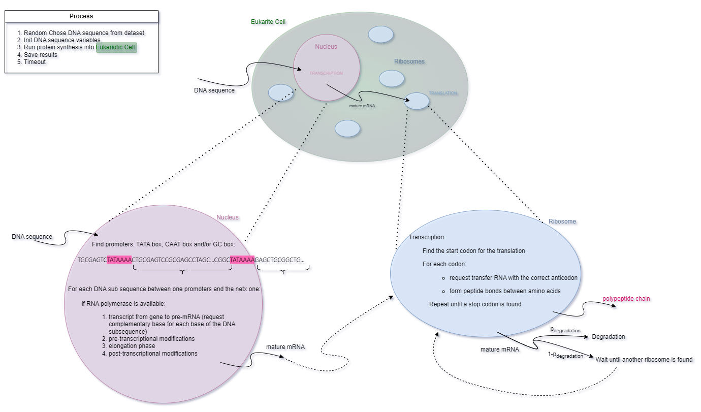

# Protein Synthesis in Eukaryotic Cells 🧬🧫🦠

This repository contains the code for a project aimed at modeling protein synthesis in eukaryotic cells as a discrete-time process.



## Repository structure (main elements)

```
ProteinSynthesis/
│
├─── HumanGenomeDataset/                     # Repository contains a dataset loaded from the RefSeq Database
│
├─── data/                                   # Data files used in simulations and experiments' parameters
│    ├─── codons.json
│    ├─── parameters_ribosome.json
│    ├─── parameters_rna_polymerases.json
│    └─── peptides.json
│
├─── src/                                    # Source code files
│    ├─── process/
│    │    ├─── protein_synthesis.py          # EukarioticCell class, simulates the protein synthesis
│    │    ├─── transcription.py              # Nucleus class, simulates the transcription process
│    │    └─── translation.py                # Ribosome class, simulates the translation process
│    │
│    ├─── resources/
│    │    ├─── container.py                  # EukaryoticCellContainer class
│    │    ├─── nucleotides.py                # Nucleotides class
│    │    ├─── resource.py                   # EukaryoticCellResource class
│    │    └─── transfer_mrna.py              # TransferRNA class
│    │
│    ├─── utils/
│    │    ├─── plot_utils.py                 # Function to visualize simulations' results
│    │    └─── utils.py                      # Utility function
│    │
│    ├─── variables/
│    │    ├─── nucleotide_allocations.py
│    │    └─── variables.py                  # Class to store the variables of the simulation
│    │
│    └─── simulation.py                      # Class to simulate the protein synthesis process
│
├─── 12h_simulation.ipynb                    # 12-hour simulation of protein synthesis
├─── comparative_analysis.ipynb              # Comparative analysis of models utilizing different resources
└─── main.py                                 # Main script to run experiments
```